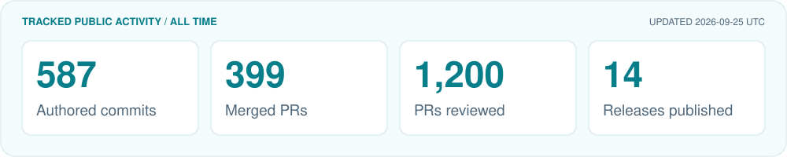

  

  <strong>Computational Physicist | Quantum Software Developer</strong> 
  Ph.D. in Physics from <a href="https://perimeterinstitute.ca/">Perimeter Institute for Theoretical Physics</a> and <a href="https://uwaterloo.ca/">University of Waterloo</a> 
  Building scientific software at <a href="https://www.xanadu.ai/">Xanadu Quantum Technologies</a>

  <a href="mailto:chenys13@outlook.com">chenys13@outlook.com</a> |
  Open to collaboration in quantum algorithms, numerical simulation, and scientific software

  Pronouns: They/Them, He/Him

<table>
  <tr>
    <td width="50%" valign="top">
      <strong>Four Pillars</strong>  
      - Physics: low-dimensional quantum many-body systems 
      - Software: scientific and open-source tooling 
      - Numerics &amp; Simulation: tensor networks and computational methods 
      - Algorithms &amp; Architectures: quantum-hybrid methods and optimization workflows
    </td>
    <td width="50%" valign="top">
      <strong>Tutoring and Consulting</strong>  
      - College-level math, physics, and computer science 
      - Graduate program application guidance 
      - Private tutoring for students and professionals
    </td>
  </tr>
</table>

## GitHub Pulse

<!-- PULSE:START -->
<picture>
  <source media="(prefers-color-scheme: dark)" srcset="./assets/pulse-dark.svg" />
  
</picture>
<!-- PULSE:END -->
